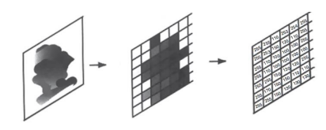
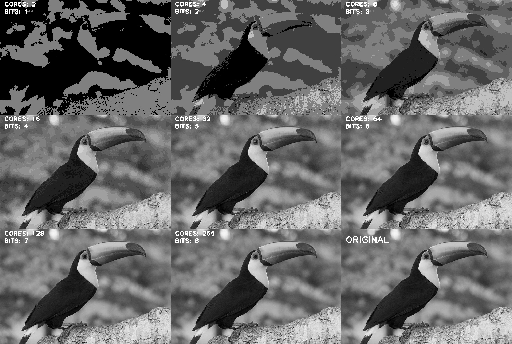

# Lista de Exercícios
## 1. Explique o processo ocorrido na figura abaixo.
<div align=center>

</div>
<br/>

Se trata da discretização da imagem, na primeira etapa a imagem é vetorizada em um plano de 2D de NxM. Em seguida é aplicado uma escala de cores e o valor de cada ponto é proporcional ao brilho da imagem naquele ponto.


## 2. Defina imagem digital.
Uma imagem digital é a representação de uma imagem bidimensional usando números binários codificados de modo a permitir seu armazenamento, transferência, impressão ou reprodução, e seu processamento por meios eletrônicos. 


## 3. Descreva os fatores que impulsionaram as aplicações usando Visão Computacional.
São quatro os principais fatores que alavancaram as pesquisas em visão computacional:
*  A proliferação de tecnologias móveis com câmeras embutidas;
* Democratização da acessibilidade ao poder computacional;
* Disponibilização e multiplicação das opções de hardwares para visão computacional e disponibilização de suas análises;
* Novos algoritmos otimizados para um melhor aproveitamento das capacidades dos softwares e hardwares;


## 4. Quais os principais desafios encontrados pelas aplicações baseadas em Visão Computacional na indústria.
Hoje os maiores desafios são a inexistência de um protocolo padrão para aquisição de dados e o fato de que os dados disponíveis podem não ser suficientes. Além disso, os Modelos construídos podem não garantir assertividade aceitável. Por último, vale salientar que não é tão simples de se medir e provar o valor comercial de soluções em visão computacional.


## 5. (DESAFIO) Implemente a função de quantização em Python usando o Google Colab.
A função está definida no arquivo `quantization.py` e é definida como:

```python
def get_quantization(image: np.ndarray, b: int) -> np.ndarray:
     """Quantiza uma imagem digital para um número
     de bits especificado de acordo como parâmetro
     b.
 
     Parameters
     ----------
     image : np.array
         Um array de numpy de shape (n,m), onde n é a amostragem da imagem
     b : int
         Um número inteiro especificando o número de bits
 
     Returns
     -------
     np.array
         Retorna um array numpy com as cores quantizadas
     """
     n_colors = 1 << b
     i_min = image.min()
     i_max = image.max()
     color_rate = MAX_VALUE / n_colors
     quantized = (n_colors - 1) * ((image - i_min) / (i_max - i_min))
     result_image = np.round(quantized) * color_rate
     describe_image(result_image, b)
 
     return result_image.astype("uint8")
 ```
Para visualização e testagem da função usa-se uma figura `tucano.jpg` contida em `images`, onde a imagem quantizada é descrita pela função `describe_image`. 
